#  MatViz3D

Voxel-based generator of polycrystalline and composite microstructures with grain statistics, crystallographic texture and micromechanical (FFT / ANSYS) homogenization

         

[](https://github.com/MME-NTU-KhPI/MatViz3D/actions/workflows/qml-development.yml)
[](https://github.com/MME-NTU-KhPI/MatViz3D/pulse)    

<!-- TODO: додати бейдж ліцензії та DOI, коли буде оформлено:

[](https://doi.org/10.5281/zenodo.17865073)
-->

___
[English Version](#english-version) | [Українська версія](#українська-версія)
___

## English Version

<p align="center">
  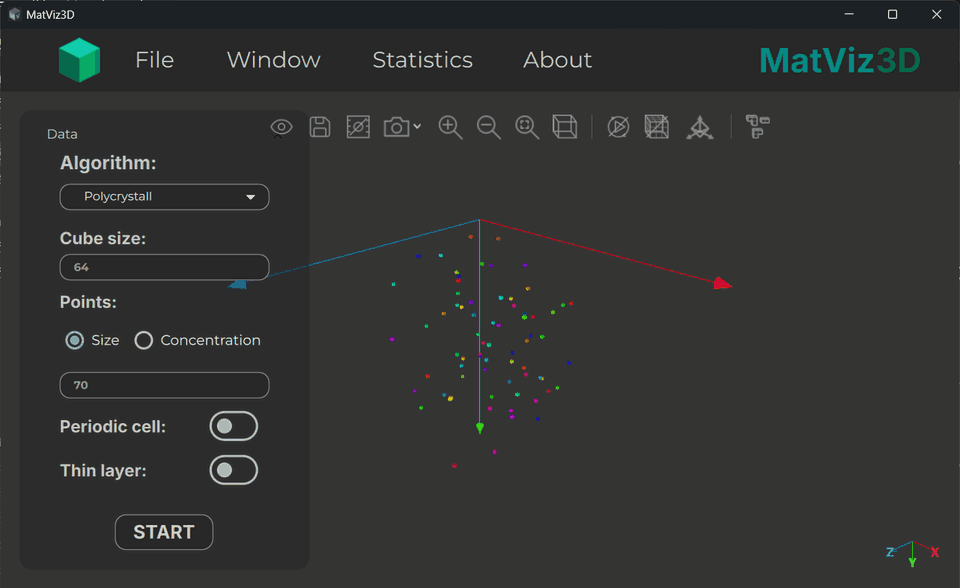
</p>

**MatViz3D** is a desktop application for generating, visualizing and analyzing three-dimensional representative volume elements (RVEs) of polycrystalline and composite materials. Microstructures are built on a voxel grid by cellular automata, Voronoi tessellation and related growth algorithms, then characterized statistically, assigned a crystallographic texture and a material from the built-in database, and passed to a micromechanical solver (in-memory FFT or ANSYS) to obtain the effective stiffness, the stress–strain fields and a Hill yield surface.

The generated RVEs and datasets are used as input for data-driven yield surfaces of polycrystalline materials (see [Publications](#publications)).

> 📖 This README only lists **what MatViz3D can do**. Parameter descriptions, algorithm details, file formats and step-by-step tutorials live in the **[GitHub Wiki](https://github.com/MME-NTU-KhPI/MatViz3D/wiki)**.

### Key Features

#### Microstructure generation

Five generation algorithms on a voxel grid, all with an optional periodic cell, material and texture assignment, and step-by-step animation of growth:

<details>
<summary><b>Polycrystall</b> — cellular-automaton grain growth (Moore / von Neumann / Radial neighbourhood)</summary>

Grains grow from random nuclei by a cellular automaton with a selectable neighbourhood stencil: **Moore** (26 neighbours — faces, edges and vertices), **von Neumann** (6 neighbours — faces only) or **Radial** (18 neighbours — faces and edges). The stencil controls the grain shape (from cube-like to almost equiaxed with smooth boundaries). Additional modes: periodic boundary conditions and a **thin-layer** mode, where all nuclei are placed on one face and the grains grow through the cube as a columnar film (`--thin-layer`, `--layer-direction`). Growth is OpenMP-parallel.

| Moore (26) | von Neumann (6) | Radial (18) | Thin film |
|:---:|:---:|:---:|:---:|
| 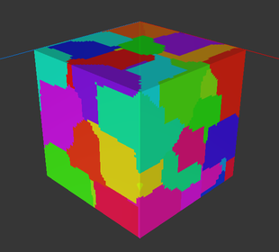 | 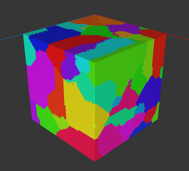 | 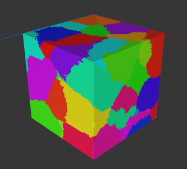 | 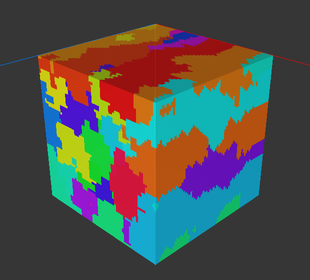 |

</details>
<details>
<summary><b>Voronoi</b> — tessellation under a Minkowski metric and a 3D metric tensor</summary>

Every voxel is assigned to the nearest seed under a generalized Minkowski *L<sub>p</sub>* metric (*p* = 1 octahedral, 2 Euclidean, large *p* cuboidal grains) and a 3D Riemannian metric tensor **M**. A diagonal tensor stretches the grains along the axes (rolled, columnar structures), off-diagonal terms rotate the elongation axes. Presets: *Sphere*, *Prolate (Needle)*, *Oblate (Disc)*, *Triaxial Ellipsoid*, *Superellipsoid (Cube)*, *Columnar (Z / X)*, *Rolled (Orthotropic)*, *Sheared (45° XY)*, *Custom*. The tessellation is exact and one-shot; the animation reveals it in distance bands.

| Euclidean, *p* = 2 | Columnar (Z-axis) preset |
|:---:|:---:|
| 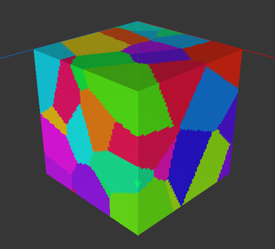 | 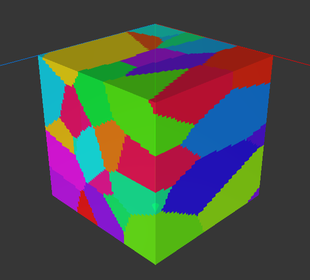 |

</details>
<details>
<summary><b>Probability</b> — stochastic automaton with anisotropic superellipsoidal kernels</summary>

The filling probability of each of the 26 neighbours is derived from a superellipsoid |x/a|<sup>p</sup> + |y/b|<sup>p</sup> + |z/c|<sup>p</sup> ≤ 1 with half-axes *a*, *b*, *c*, exponent *p* and three Euler rotation angles, which gives textured, elongated or flattened grains. Shape presets (*Sphere*, *Prolate*, *Oblate*, *Triaxial*, *Superellipsoid*, *Custom*), two kernel construction modes (*Volume Sampling* / *Surface Flux*), a thermodynamic **Stefan number** that limits the growth rate (cooling), and **continuous wave nucleation** where new nuclei appear as the solid fraction grows (initial nuclei, peak and end fractions). Results are bit-for-bit reproducible for a given seed regardless of the thread count.

| Prolate (Needle) preset | Wave nucleation |
|:---:|:---:|
| 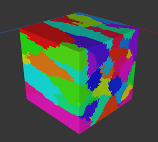 | 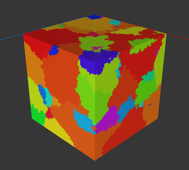 |

</details>
<details>
<summary><b>Composite</b> — fibre-reinforced RVE</summary>

One, two or three orthogonal families of continuous elliptical fibres (1D along Z, 2D along X and Y, 3D along X, Y and Z) on a square or hexagonal lattice. The fibre radius is bisected to hit the **target volume fraction** exactly; imperfections — centre jitter, cross-section aspect ratio, in-plane angle scatter, optional overlap. The matrix and the fibres are two different materials from the database (e.g. epoxy / carbon fibre, epoxy / E-glass), and both solvers use the full anisotropic (transversely isotropic) fibre stiffness rotated into each fibre's own axis.

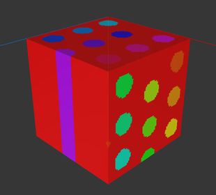

</details>
<details>
<summary><b>DLCA</b> — diffusion-limited cluster aggregation</summary>

Particles perform random walks and stick together on contact, growing fractal, dendrite-like aggregates that can be used as porous or skeletal structures.

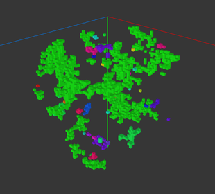

</details>

Legacy names (`Moore`, `Neumann`, `Radial`, `Probability Circle`, `Probability Ellipse`) are still accepted as aliases on the command line.

#### Visualization and analysis

- **3D viewport** (OpenGL): rotation, zoom, isometric/dimetric presets, exploded view, orientation triad, grain legend, animation of growth with adjustable speed; deformed-shape rendering of the solved fields with a colormap legend.
- **Grain statistics**: histograms and descriptive statistics of 3D grain properties (volume, surface area, equivalent sphere radius, moments of inertia…) and of 2D sections; after a stress solve — distributions of the deformed state (full-volume voxel fields or per-grain means, kernel density estimation). Export to PNG / SVG / CSV.
- **Crystallographic texture editor**: presets `random`, `extrusion`, `rolling`, `recrystallization`, `shear`, `scattered_cube` for FCC and BCC lattices with adjustable scatter; standard components Cube {001}<100>, Goss {110}<001>, Copper {112}<11-1>, Brass {110}<112>, S {123}<634> and fibre textures; conversion between Miller indices, Bunge Euler angles and ANSYS rotation angles; ODF sections.
- **Material database** (SQLite, editable in the app): ~40 materials with the full 21-constant elasticity matrix (c11…c66) and lattice type — cubic metals (Cu, Fe, Al, W, Ni…), hcp metals, semiconductors, ceramics, and composite constituents (Epoxy, E-glass, Al2O3, SiC, C-fiber).
- **Stress analysis of the RVE** with two interchangeable solvers writing the same HDF5 schema:
  - **FFT** — built-in spectral (Moulinec–Suquet) homogenization, no external software, live convergence plot;
  - **ANSYS** — automatic export of the voxel geometry to SOLID185 elements, APDL generation and result parsing.

  Modes: `stiffness` (6 unit-strain solves → effective compliance **S**, stiffness **C**, Poisson matrix and engineering moduli), `single` (one prescribed macroscopic strain tensor) and `dataset` (Hill yield-criterion calibration on random loads, then hundreds of load cases on the Hill ellipsoid with full per-voxel stress/strain fields). Results: **elastic anisotropy surface** (directional Young's modulus, Zener ratio, bulk modulus), **tensor glyphs and hyperstreamlines** of the stress/strain fields on slices, von Mises fields on the deformed shape.
- **HDF5 project viewer**: open previously saved datasets, browse load steps on a timeline scrubber, inspect generator parameters, effective stiffness, applied loading and deformed statistics without re-computing anything.
- **Export**: PNG (with automatic cropping, 300 DPI, legend cards), true-vector SVG, clipboard, CSV (voxels, statistics, load steps), VRML, HDF5.

#### Automation

- **Command-line / headless mode** (`--nogui --autostart`) for batch generation and dataset building on a cluster; `--help-json` dumps the complete option schema, algorithms, materials and ready-made recipes as JSON for scripts and AI agents.
- **Python package [`pymv3d`](https://github.com/MME-NTU-KhPI/matviz3d-py)** — a thin launcher + HDF5-to-NumPy reader (voxels, orientations, S/C/P tensors, per-voxel stress and strain fields, macro response).
- **OpenMP** parallelism with the thread count auto-detected from the physical cores.

### Examples

Growth of microstructures by different algorithms, recorded from the 3D viewport (`--animate`):

|  | 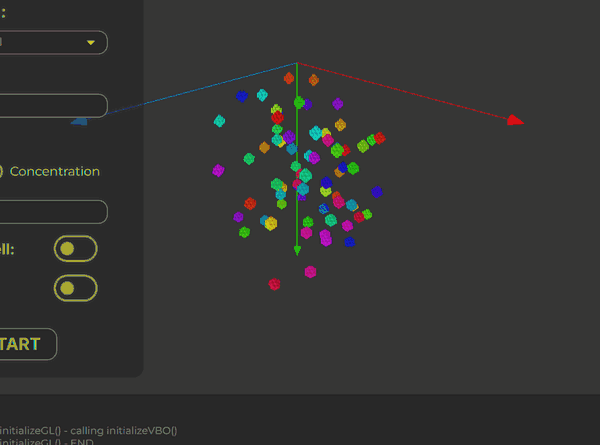 |
|:---:|:---:|
| Polycrystall — Moore (26) | Polycrystall — von Neumann (6) |

| 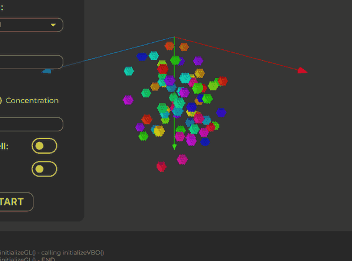 | 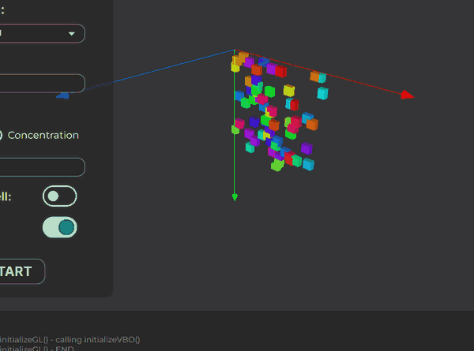 |
|:---:|:---:|
| Polycrystall — Radial (18) | Polycrystall — thin-film mode (`--thin-layer`) |

| 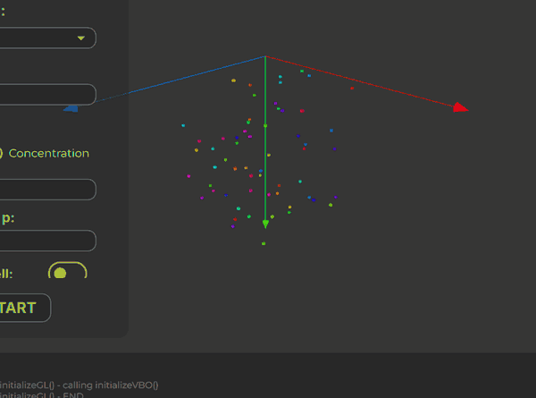 | 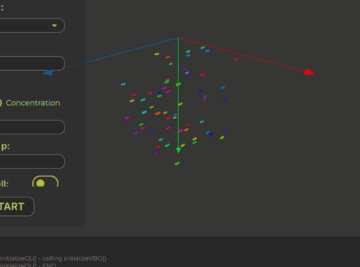 |
|:---:|:---:|
| Voronoi, Euclidean metric | Voronoi, *Columnar (Z-axis)* metric preset |

| 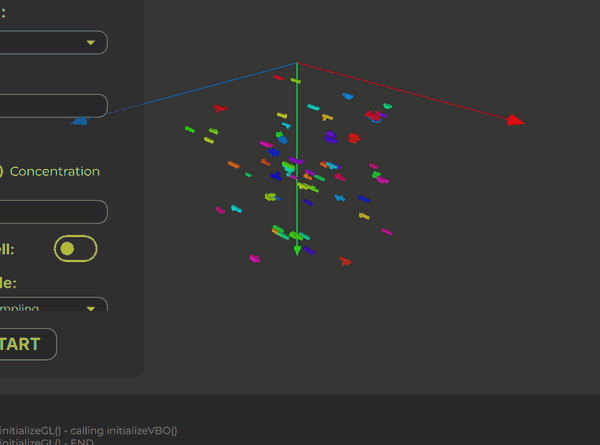 | 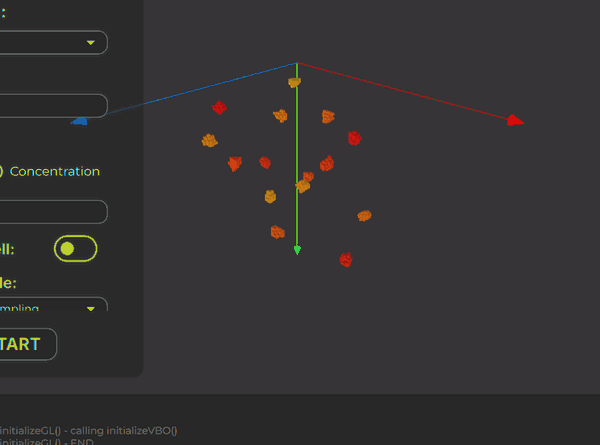 |
|:---:|:---:|
| Probability — *Prolate (Needle)* kernel | Probability — wave nucleation |

| 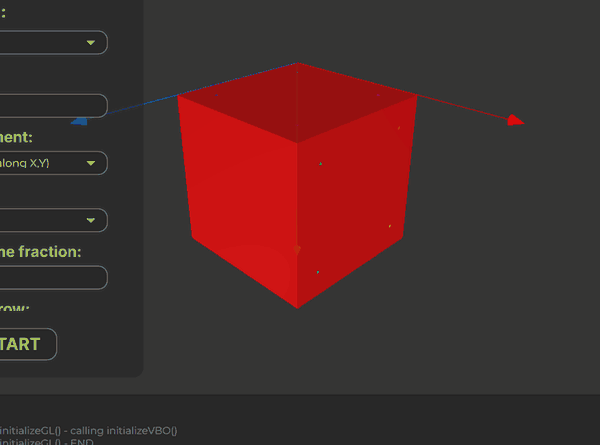 | 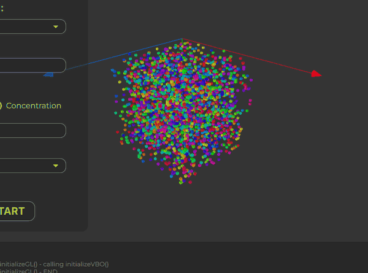 |
|:---:|:---:|
| Composite — 2D hexagonal fibre packing, V<sub>f</sub> = 0.4 | DLCA — cluster aggregation |

<!-- TODO (screenshots of the other windows, add when ready):
|  |  |
| Grain statistics | Crystallographic texture editor |
|  |  |
| Stress analysis | Elastic anisotropy surface |
|  |  |
| Material database | HDF5 project viewer |
-->

### Installation

#### Ready-made builds

Download the installer or package for your platform from the [Releases](https://github.com/MME-NTU-KhPI/MatViz3D/releases) page:

| Platform | File |
|---|---|
| Windows | `MatViz3D-Setup.exe` |
| Linux (Debian/Ubuntu) | `matviz3d_*.deb` |
| Linux (Fedora/RHEL) | `matviz3d-*.rpm` |

The ANSYS solver additionally requires a licensed ANSYS Mechanical APDL reachable from `PATH`; the FFT solver has no external dependencies.

#### Building from source

Requirements:

- **Qt 6.6.3** or newer (developed against 6.8; modules `quick`, `quickcontrols2`, `sql`, `printsupport`, `opengl`, `widgets`, `openglwidgets`, `quickwidgets`, `concurrent`, `qt5compat`)
- C++17 compiler with **OpenMP** (GCC / MinGW / Clang)
- **HDF5** library (auto-detected by `MatViz3D.pro`: `C:\Program Files\HDF_Group\HDF5\<version>` on Windows, `/usr/include/hdf5/serial` on Linux)
- OpenGL

```bash
# Linux (Ubuntu) dependencies
sudo apt-get install build-essential libgl1-mesa-dev libglu1-mesa-dev \
                     mesa-common-dev libhdf5-dev

git clone https://github.com/MME-NTU-KhPI/MatViz3D.git
cd MatViz3D
qmake6 MatViz3D.pro CONFIG+=release
make -j$(nproc)
```

```bat
:: Windows (MinGW from the Qt installer)
C:\Qt\6.8.1\mingw_64\bin\qtenv2.bat
qmake MatViz3D.pro CONFIG+=release
mingw32-make -j4
```

<!-- TODO: перевірити та вказати гілку за замовчуванням (зараз збірка йде з qml-development) -->

### Usage

#### Graphical interface

1. Launch the application.
2. Set the cube size and the number of nuclei (or their concentration in % of the volume).
3. Pick a generation algorithm — the parameter panel adapts to it (neighbourhood, metric preset, kernel shape, fibre layout…).
4. Press **START** and follow the growth in the 3D viewport (toggle animation and its speed on the toolbar).
5. Rotate, zoom, cut and explode the cube; open **Statistics** for histograms of grain properties.
6. Optionally assign a texture (**Window → Texture**) and a material (**Window → Materials**).
7. Run **Window → Stress analysis**: choose FFT or ANSYS and the mode (stiffness / single / dataset); inspect the moduli, the anisotropy surface and the fields on the deformed shape.
8. Save the structure or the whole dataset as HDF5 and re-open it later in the **HDF5 project** window; export images and CSV tables.

#### Command line

```bash
# Periodic Voronoi polycrystal, 30³ voxels, 50 grains, copper
MatViz3D --nogui --autostart --algorithm Voronoi --size 30 --points 50 --periodic \
         --material Cu --seed 42 --output voronoi.hdf5

# Cellular automaton (Moore), thin-film mode
MatViz3D --nogui --autostart --algorithm Polycrystall --neighborhood Moore --size 64 \
         --points 60 --thin-layer --layer-direction +Z --output film.hdf5

# Elongated grains: probabilistic automaton with a rotated superellipsoid kernel
MatViz3D --nogui --autostart --algorithm Probability --size 80 --concentration 0.05 \
         --halfaxis_a 3.0 --halfaxis_b 1.0 --halfaxis_c 1.0 --orientation_angle_c 30 \
         --stefan_number 100 --output elongated.hdf5

# 2D hexagonal carbon/epoxy composite, 40 % fibre volume fraction
MatViz3D --nogui --autostart --algorithm Composite --size 40 --composite_dim 2d \
         --composite_packing hexagonal --fiber_volume_fraction 0.4 \
         --matrix_material Epoxy --fiber_material C-fiber --output composite.hdf5

# Effective stiffness (6 unit-strain FFT solves) of an aluminium polycrystal with rolling texture
MatViz3D --nogui --autostart --algorithm Voronoi --size 32 --points 60 --material Al \
         --texture rolling --scatter 11 \
         --run_stress_calc --solver fft --stress_mode stiffness --output stiffness.hdf5

# Full dataset: Hill calibration + 300 load cases with per-voxel fields
MatViz3D --nogui --autostart --algorithm Polycrystall --size 32 --points 60 --material Cu \
         --run_stress_calc --solver fft --stress_mode dataset --num_rnd_loads 150 --output dataset.hdf5
```

> **Note:** in headless mode the structure is written to `--output` together with the stress results; use `--stress_mode stiffness` for the cheapest run that still stores the voxel grid.

<details>
<summary>Full list of options (<code>MatViz3D --help</code>, machine-readable: <code>--help-json</code>)</summary>

| Option | Description |
|---|---|
| **Execution** | |
| `--nogui` | Headless batch mode (requires `--autostart`) |
| `--autostart` | Start generation automatically |
| `--animate` | Grow the structure iteration by iteration |
| `--nologo` | Suppress the ASCII banner |
| `--np <n>` | Number of OpenMP threads (default: physical cores) |
| `--seed <n>` | RNG seed (default: current time) |
| `--output <file>` | Output HDF5 file (default `current_ls.hdf5`) |
| `--help`, `--version`, `--help-json` | Help, version, JSON schema of the CLI |
| **Grid & nucleation** | |
| `--size <n>` | Cube edge in voxels |
| `--points <n>` | Number of nuclei / grains |
| `--concentration <%>` | Nuclei density in % of the volume (overrides `--points`) |
| `--algorithm <name>` | `Voronoi`, `Polycrystall`, `Probability`, `Composite`, `DLCA` (aliases: `Moore`, `Neumann`, `Radial`, `Probability Circle`, `Probability Ellipse`) |
| `--periodic` | Periodic boundary conditions |
| `--neighborhood <stencil>` | Polycrystall stencil: `Moore`, `Neumann`, `Radial` |
| `--thin-layer`, `--layer-direction <±X\|±Y\|±Z>` | Thin-film mode: all nuclei on one face |
| **Voronoi** | |
| `--minkowski_p <p>` | Minkowski exponent (1 Manhattan, 2 Euclidean, large → Chebyshev) |
| `--voronoi_metric_preset <name>` | `Sphere (Circle)`, `Prolate (Needle)`, `Oblate (Disc)`, `Triaxial Ellipsoid`, `Superellipsoid (Cube)`, `Columnar (Z-axis)`, `Columnar (X-axis)`, `Rolled (Orthotropic)`, `Sheared (45 deg XY)`, `Custom` |
| `--voronoi_metric <mxx,myy,mzz[,mxy,myz,mxz]>`, `--voronoi_mxx` … `--voronoi_mxz` | Metric tensor components |
| **Probability** | |
| `--prob_preset <name>` | Kernel shape preset (same names as above) |
| `--prob_matrix_mode <volume\|surface>` | Kernel construction: volume sampling / surface flux |
| `--halfaxis_a/b/c <v>` | Kernel half-axes |
| `--orientation_angle_a/b/c <deg>` | Kernel rotation about X / Y / Z |
| `--ellipse_order <p>` | Superellipsoid exponent |
| `--stefan_number <v>` | Stefan (cooling) number |
| `--wave_generation`, `--initial_nuclei <n>`, `--wave_peak_fraction <0..1>`, `--wave_end_fraction <0..1>` | Continuous wave nucleation |
| **Composite** | |
| `--composite_dim <1d\|2d\|3d>`, `--composite_packing <square\|hexagonal>` | Fibre families and lattice |
| `--fiber_volume_fraction <0..1>`, `--fibers_per_row <n>` | Target V<sub>f</sub> and lattice density |
| `--fiber_aspect_ratio <a/b>`, `--fiber_angle_scatter <deg>`, `--fiber_center_jitter <0..1>`, `--fiber_allow_overlap` | Imperfections |
| `--matrix_material <name>`, `--fiber_material <name>` | The two constituents |
| **Material & texture** | |
| `--material <name>` | Material from the database (Cu, Fe, Al, W, …) |
| `--texture <preset>` | `random`, `extrusion`, `rolling`, `recrystallization`, `shear`, `scattered_cube` |
| `--lattice <fcc\|bcc>`, `--scatter <deg>` | Lattice override and texture scatter |
| **Stress analysis** | |
| `--run_stress_calc` | Run the homogenization after generation |
| `--solver <fft\|ansys>` | Solver (default `ansys`) |
| `--stress_mode <stiffness\|single\|dataset>` | Mode (default `dataset`) |
| `--eps <exx,eyy,ezz,exy,eyz,exz>` | Prescribed strain for `single` |
| `--num_rnd_loads <n>` | Random loads for the Hill fit in `dataset` |
| `--working_directory <dir>` | ANSYS working directory |

</details>

#### Python

```python
from pymv3d import MatViz3DLauncher, GenParams, StressParams, MatViz3DResult

mv = MatViz3DLauncher("/path/to/MatViz3D")
mv.run(GenParams(size=40, points=60, algorithm="Voronoi", material="Cu"),
       StressParams(run=True, solver="fft", mode="stiffness"), output="run.hdf5")

r = MatViz3DResult("run.hdf5")
voxels = r.voxels(0)        # (40, 40, 40) grain ids
C = r.stiffness(0)          # (6, 6) effective stiffness
```

### Publications

If you use MatViz3D in your research, please cite:

<!-- TODO: уточнити сторінки / DOI після публікації матеріалів ICoRSE 2026 -->

- Hritskova, V., Vodka, O., Shapovalova, M., Semenenko, O., Chang, L., Hartmaier, A., Shoghi, R. *Data-Driven Characterization of Probabilistic Yield Surfaces in Polycrystalline Materials via Adaptive Stress-Space Sampling*. ICoRSE (2026).
- Hritskova, V., et al. *Software development for modeling microstructures of polycrystalline materials by cellular automata*. Proc. IEEE KhPIWeek, pp. 1–6 (2024).
- Hritskova, V., et al. *Sensitivity analysis of parameters used to generate material microstructures by cellular automata*. LNNS 1473, pp. 118–129 (2025).
- Vodka, O., et al. *MatViz3D Synthetic 3D Microstructure Dataset of Single Crystal FCC Copper*. Zenodo (2026). doi:[10.5281/zenodo.17865073](https://doi.org/10.5281/zenodo.17865073)

### Authors

Department of Applied Mathematics / Mechanical Engineering, National Technical University "Kharkiv Polytechnic Institute"

<!-- TODO: звірити список і ролі з поточним складом команди -->

🗲 Oleksii Vodka ([a-vodka](https://github.com/a-vodka)) — supervisor, development \
🗲 Valeriia Hritskova ([Val2004H](https://github.com/Val2004H)) — development \
🗲 Oleh Semenenko ([HappyNext](https://github.com/HappyNext)) — development \
🗲 Nikita Mityasov ([Nekit2003](https://github.com/Nekit2003)) — development \
🗲 Mariia Shapovalova — research \
🗲 Anastasiіa Korzh, Hanna Khominich — testing \
🗲 Kateryna Skrynnyk ([Skvirell](https://github.com/Skvirell)), Violetta Katsylo — UX/UI design \
🗲 Yuliia Chepela — 3D technologies

### License

<!-- TODO: додати файл LICENSE у репозиторій -->

MIT License.

___

## Українська версія

<p align="center">
  
</p>

**MatViz3D** — це десктопний застосунок для генерації, візуалізації та аналізу тривимірних представницьких об'ємних елементів (RVE) полікристалічних і композитних матеріалів. Мікроструктури будуються на вокселній сітці клітинними автоматами, тесселяцією Вороного та спорідненими алгоритмами росту, після чого статистично характеризуються, отримують кристалографічну текстуру й матеріал із вбудованої бази даних і передаються до мікромеханічного розв'язувача (вбудований FFT або ANSYS) для отримання ефективної жорсткості, полів напружень і деформацій та поверхні текучості Хілла.

Згенеровані RVE та набори даних використовуються як вхідні дані для побудови ймовірнісних поверхонь текучості полікристалічних матеріалів (див. [Публікації](#публікації)).

> 📖 У цьому README перелічено лише **що вміє MatViz3D**. Опис параметрів, деталі алгоритмів, формати файлів та покрокові інструкції — у **[GitHub Wiki](https://github.com/MME-NTU-KhPI/MatViz3D/wiki)**.

### Основні можливості

#### Генерація мікроструктур

П'ять алгоритмів генерації на вокселній сітці; для всіх доступні періодична комірка, призначення матеріалу й текстури та покрокова анімація росту:

<details>
<summary><b>Polycrystall</b> — ріст зерен клітинним автоматом (околиця Мура / фон Неймана / радіальна)</summary>

Зерна ростуть із випадкових зародків за правилами клітинного автомата з вибором околиці: **Мура** (26 сусідів — спільні грані, ребра та вершини), **фон Неймана** (6 сусідів — лише грані) або **радіальна** (18 сусідів — грані та ребра). Тип околиці визначає форму зерен (від кубоподібних до майже рівновісних із гладкими межами). Додатково: періодичні граничні умови та режим **тонкої плівки**, коли всі зародки розміщуються на одній грані й зерна проростають крізь куб стовпчастою плівкою (`--thin-layer`, `--layer-direction`). Ріст розпаралелено через OpenMP.

| Мура (26) | фон Неймана (6) | Радіальна (18) | Тонка плівка |
|:---:|:---:|:---:|:---:|
|  |  |  |  |

</details>
<details>
<summary><b>Voronoi</b> — тесселяція за метрикою Мінковського та 3D метричним тензором</summary>

Кожен воксель відноситься до найближчого зародка за узагальненою метрикою Мінковського *L<sub>p</sub>* (*p* = 1 — октаедричні, 2 — евклідові, великі *p* — кубоподібні зерна) та 3D рімановим метричним тензором **M**. Діагональний тензор розтягує зерна вздовж осей (прокатані, стовпчасті структури), позадіагональні компоненти повертають осі видовження. Пресети: *Sphere*, *Prolate (Needle)*, *Oblate (Disc)*, *Triaxial Ellipsoid*, *Superellipsoid (Cube)*, *Columnar (Z / X)*, *Rolled (Orthotropic)*, *Sheared (45° XY)*, *Custom*. Тесселяція точна й одномоментна; анімація розкриває її смугами відстані.

| Евклідова, *p* = 2 | Пресет Columnar (Z-axis) |
|:---:|:---:|
|  |  |

</details>
<details>
<summary><b>Probability</b> — стохастичний автомат з анізотропними суперелiпсоїдальними ядрами</summary>

Імовірність заповнення кожного з 26 сусідів виводиться із суперелiпсоїда |x/a|<sup>p</sup> + |y/b|<sup>p</sup> + |z/c|<sup>p</sup> ≤ 1 з півосями *a*, *b*, *c*, степенем *p* і трьома кутами Ейлера, що дає текстуровані, видовжені або сплощені зерна. Пресети форми (*Sphere*, *Prolate*, *Oblate*, *Triaxial*, *Superellipsoid*, *Custom*), два способи побудови ядра (*Volume Sampling* / *Surface Flux*), термодинамічне **число Стефана**, що обмежує швидкість росту (охолодження), та **неперервна хвильова нуклеація** — нові зародки з'являються в міру зростання частки твердої фази (початкові зародки, частки піку та завершення). Для заданого seed результат відтворюється біт у біт незалежно від кількості потоків.

| Пресет Prolate (Needle) | Хвильова нуклеація |
|:---:|:---:|
|  |  |

</details>
<details>
<summary><b>Composite</b> — RVE волокнистого композита</summary>

Одна, дві або три ортогональні сім'ї неперервних еліптичних волокон (1D вздовж Z, 2D вздовж X і Y, 3D вздовж X, Y, Z) на квадратній або гексагональній ґратці. Радіус волокон підбирається бісекцією так, щоб точно вийти на **задану об'ємну частку**; недосконалості — зміщення центрів, співвідношення півосей перерізу, розкид кутів у площині, дозвіл на перекриття. Матриця й волокна — два різні матеріали з бази (наприклад епоксид / вуглецеве волокно, епоксид / E-скло); обидва розв'язувачі використовують повну анізотропну (трансверсально-ізотропну) жорсткість волокна, повернуту у вісь кожного волокна.


</details>
<details>
<summary><b>DLCA</b> — агрегація кластерів, обмежена дифузією</summary>

Частинки виконують випадкові блукання і злипаються при контакті, утворюючи фрактальні дендритоподібні агрегати — основу для пористих і каркасних структур.


</details>

Старі назви (`Moore`, `Neumann`, `Radial`, `Probability Circle`, `Probability Ellipse`) і далі приймаються в командному рядку як синоніми.

#### Візуалізація та аналіз

- **3D-в'юпорт** (OpenGL): обертання, масштабування, ізометричні/диметричні ракурси, «розібраний» куб, тріада осей, легенда зерен, анімація росту з регульованою швидкістю; відображення розрахованих полів на деформованій формі з кольоровою легендою.
- **Статистика зерен**: гістограми та описові статистики 3D-властивостей зерен (об'єм, площа поверхні, радіус еквівалентної сфери, моменти інерції…) і 2D-перерізів; після розрахунку напружень — розподіли деформованого стану (повні вокселні поля або середні по зернах, оцінка густини ядром). Експорт у PNG / SVG / CSV.
- **Редактор кристалографічної текстури**: пресети `random`, `extrusion`, `rolling`, `recrystallization`, `shear`, `scattered_cube` для ґраток FCC і BCC з регульованим розсіюванням; стандартні компоненти Cube {001}<100>, Goss {110}<001>, Copper {112}<11-1>, Brass {110}<112>, S {123}<634> та аксіальні текстури; перетворення між індексами Міллера, кутами Бунге та кутами повороту ANSYS; перерізи ODF.
- **База даних матеріалів** (SQLite, редагується в застосунку): ~40 матеріалів з повною матрицею пружності з 21 константи (c11…c66) і типом ґратки — кубічні метали (Cu, Fe, Al, W, Ni…), ГЩП-метали, напівпровідники, кераміка та складники композитів (Epoxy, E-glass, Al2O3, SiC, C-fiber).
- **Аналіз напружень RVE** двома взаємозамінними розв'язувачами, що пишуть однакову схему HDF5:
  - **FFT** — вбудована спектральна гомогенізація (Мулінек–Сюке), без стороннього ПЗ, з живим графіком збіжності;
  - **ANSYS** — автоматичний експорт вокселної геометрії в елементи SOLID185, генерація APDL та зчитування результатів.

  Режими: `stiffness` (6 розв'язків для одиничних деформацій → ефективні матриці податливості **S**, жорсткості **C**, матриця Пуассона й технічні модулі), `single` (один заданий макроскопічний тензор деформацій) та `dataset` (калібрування критерію Хілла на випадкових навантаженнях, далі сотні випадків навантаження на еліпсоїді Хілла з повними повоксельними полями напружень і деформацій). Результати: **поверхня пружної анізотропії** (напрямний модуль Юнга, коефіцієнт Зенера, об'ємний модуль), **тензорні гліфи та гіперлінії струму** полів на перерізах, поля Мізеса на деформованій формі.
- **Переглядач HDF5-проєктів**: відкриття збережених наборів даних, перегляд кроків навантаження на часовій шкалі, параметри генератора, ефективна жорсткість, прикладене навантаження і статистика деформованого стану — без повторного розрахунку.
- **Експорт**: PNG (з автообрізанням, 300 DPI, картками легенди), справжній векторний SVG, буфер обміну, CSV (воксели, статистики, кроки навантаження), VRML, HDF5.

#### Автоматизація

- **Командний рядок / headless-режим** (`--nogui --autostart`) для пакетної генерації та побудови наборів даних на кластері; `--help-json` виводить повну схему опцій, алгоритми, матеріали та готові рецепти у JSON для скриптів і AI-агентів.
- **Python-пакет [`pymv3d`](https://github.com/MME-NTU-KhPI/matviz3d-py)** — тонкий запускач + читач HDF5 у NumPy (воксели, орієнтації, тензори S/C/P, повоксельні поля напружень і деформацій, макровідгук).
- **Паралельні обчислення** з OpenMP, кількість потоків визначається автоматично за числом фізичних ядер.

### Приклади

Ріст мікроструктур різними алгоритмами, записаний з 3D-в'юпорту (`--animate`):

|  |  |
|:---:|:---:|
| Polycrystall — Мура (26) | Polycrystall — фон Неймана (6) |

|  |  |
|:---:|:---:|
| Polycrystall — радіальна (18) | Polycrystall — режим тонкої плівки (`--thin-layer`) |

|  |  |
|:---:|:---:|
| Voronoi, евклідова метрика | Voronoi, метричний пресет *Columnar (Z-axis)* |

|  |  |
|:---:|:---:|
| Probability — ядро *Prolate (Needle)* | Probability — хвильова нуклеація |

|  |  |
|:---:|:---:|
| Composite — 2D гексагональне укладання волокон, V<sub>f</sub> = 0.4 | DLCA — агрегація кластерів |

<!-- TODO (знімки інших вікон, додати коли будуть готові):
|  |  |
| Статистика зерен | Редактор кристалографічної текстури |
|  |  |
| Аналіз напружень | Поверхня пружної анізотропії |
|  |  |
| База даних матеріалів | Переглядач HDF5-проєктів |
-->

### Встановлення

#### Готові збірки

Завантажте інсталятор або пакет для вашої платформи зі сторінки [Releases](https://github.com/MME-NTU-KhPI/MatViz3D/releases):

| Платформа | Файл |
|---|---|
| Windows | `MatViz3D-Setup.exe` |
| Linux (Debian/Ubuntu) | `matviz3d_*.deb` |
| Linux (Fedora/RHEL) | `matviz3d-*.rpm` |

Для розв'язувача ANSYS додатково потрібен ліцензований ANSYS Mechanical APDL, доступний через `PATH`; FFT-розв'язувач не має зовнішніх залежностей.

#### Збірка з вихідних кодів

Вимоги:

- **Qt 6.6.3** або новіша (розробка ведеться на 6.8; модулі `quick`, `quickcontrols2`, `sql`, `printsupport`, `opengl`, `widgets`, `openglwidgets`, `quickwidgets`, `concurrent`, `qt5compat`)
- Компілятор C++17 з підтримкою **OpenMP** (GCC / MinGW / Clang)
- Бібліотека **HDF5** (визначається автоматично у `MatViz3D.pro`: `C:\Program Files\HDF_Group\HDF5\<version>` на Windows, `/usr/include/hdf5/serial` на Linux)
- OpenGL

```bash
# Залежності (Ubuntu)
sudo apt-get install build-essential libgl1-mesa-dev libglu1-mesa-dev \
                     mesa-common-dev libhdf5-dev

git clone https://github.com/MME-NTU-KhPI/MatViz3D.git
cd MatViz3D
qmake6 MatViz3D.pro CONFIG+=release
make -j$(nproc)
```

```bat
:: Windows (MinGW з інсталятора Qt)
C:\Qt\6.8.1\mingw_64\bin\qtenv2.bat
qmake MatViz3D.pro CONFIG+=release
mingw32-make -j4
```

<!-- TODO: перевірити та вказати гілку за замовчуванням (зараз збірка йде з qml-development) -->

### Використання

#### Графічний інтерфейс

1. Запустіть застосунок.
2. Задайте розмір куба та кількість зародків (або їх концентрацію у % об'єму).
3. Оберіть алгоритм генерації — панель параметрів підлаштовується під нього (околиця, метричний пресет, форма ядра, укладання волокон…).
4. Натисніть **START** і спостерігайте за ростом у 3D-в'юпорті (анімацію та її швидкість вмикають на панелі інструментів).
5. Обертайте, масштабуйте, ріжте та «розбирайте» куб; відкрийте **Statistics** для гістограм властивостей зерен.
6. За потреби задайте текстуру (**Window → Texture**) і матеріал (**Window → Materials**).
7. Запустіть **Window → Stress analysis**: оберіть FFT або ANSYS та режим (stiffness / single / dataset); перегляньте модулі, поверхню анізотропії та поля на деформованій формі.
8. Збережіть структуру або весь набір даних у HDF5 і відкрийте його пізніше у вікні **HDF5 project**; експортуйте зображення та CSV-таблиці.

#### Командний рядок

```bash
# Періодичний полікристал Вороного, 30³ вокселів, 50 зерен, мідь
MatViz3D --nogui --autostart --algorithm Voronoi --size 30 --points 50 --periodic \
         --material Cu --seed 42 --output voronoi.hdf5

# Клітинний автомат (Мура), режим тонкої плівки
MatViz3D --nogui --autostart --algorithm Polycrystall --neighborhood Moore --size 64 \
         --points 60 --thin-layer --layer-direction +Z --output film.hdf5

# Видовжені зерна: імовірнісний автомат з повернутим суперелiпсоїдальним ядром
MatViz3D --nogui --autostart --algorithm Probability --size 80 --concentration 0.05 \
         --halfaxis_a 3.0 --halfaxis_b 1.0 --halfaxis_c 1.0 --orientation_angle_c 30 \
         --stefan_number 100 --output elongated.hdf5

# 2D гексагональний композит вуглець/епоксид, 40 % волокон
MatViz3D --nogui --autostart --algorithm Composite --size 40 --composite_dim 2d \
         --composite_packing hexagonal --fiber_volume_fraction 0.4 \
         --matrix_material Epoxy --fiber_material C-fiber --output composite.hdf5

# Ефективна жорсткість (6 FFT-розв'язків) алюмінієвого полікристала з текстурою прокатки
MatViz3D --nogui --autostart --algorithm Voronoi --size 32 --points 60 --material Al \
         --texture rolling --scatter 11 \
         --run_stress_calc --solver fft --stress_mode stiffness --output stiffness.hdf5

# Повний набір даних: калібрування Хілла + 300 навантажень з повоксельними полями
MatViz3D --nogui --autostart --algorithm Polycrystall --size 32 --points 60 --material Cu \
         --run_stress_calc --solver fft --stress_mode dataset --num_rnd_loads 150 --output dataset.hdf5
```

> **Примітка:** у headless-режимі структура записується у `--output` разом із результатами розрахунку напружень; найдешевший запуск, який зберігає вокселну сітку, — `--stress_mode stiffness`.

<details>
<summary>Повний перелік опцій (<code>MatViz3D --help</code>, машиночитаний варіант: <code>--help-json</code>)</summary>

| Опція | Опис |
|---|---|
| **Виконання** | |
| `--nogui` | Headless-режим без інтерфейсу (потребує `--autostart`) |
| `--autostart` | Автоматично запустити генерацію |
| `--animate` | Ростити структуру ітерація за ітерацією |
| `--nologo` | Не друкувати ASCII-банер |
| `--np <n>` | Кількість потоків OpenMP (за замовчуванням — фізичні ядра) |
| `--seed <n>` | Зерно генератора випадкових чисел (за замовчуванням — поточний час) |
| `--output <file>` | Вихідний HDF5-файл (за замовчуванням `current_ls.hdf5`) |
| `--help`, `--version`, `--help-json` | Довідка, версія, JSON-схема CLI |
| **Сітка та зародки** | |
| `--size <n>` | Розмір ребра куба у вокселях |
| `--points <n>` | Кількість зародків / зерен |
| `--concentration <%>` | Концентрація зародків у % об'єму (має пріоритет над `--points`) |
| `--algorithm <name>` | `Voronoi`, `Polycrystall`, `Probability`, `Composite`, `DLCA` (синоніми: `Moore`, `Neumann`, `Radial`, `Probability Circle`, `Probability Ellipse`) |
| `--periodic` | Періодичні граничні умови |
| `--neighborhood <stencil>` | Околиця Polycrystall: `Moore`, `Neumann`, `Radial` |
| `--thin-layer`, `--layer-direction <±X\|±Y\|±Z>` | Режим тонкої плівки: усі зародки на одній грані |
| **Voronoi** | |
| `--minkowski_p <p>` | Показник Мінковського (1 — манхеттенська, 2 — евклідова, великий → Чебишова) |
| `--voronoi_metric_preset <name>` | `Sphere (Circle)`, `Prolate (Needle)`, `Oblate (Disc)`, `Triaxial Ellipsoid`, `Superellipsoid (Cube)`, `Columnar (Z-axis)`, `Columnar (X-axis)`, `Rolled (Orthotropic)`, `Sheared (45 deg XY)`, `Custom` |
| `--voronoi_metric <mxx,myy,mzz[,mxy,myz,mxz]>`, `--voronoi_mxx` … `--voronoi_mxz` | Компоненти метричного тензора |
| **Probability** | |
| `--prob_preset <name>` | Пресет форми ядра (ті самі назви, що вище) |
| `--prob_matrix_mode <volume\|surface>` | Побудова ядра: об'ємне семплювання / поверхневий потік |
| `--halfaxis_a/b/c <v>` | Півосі ядра |
| `--orientation_angle_a/b/c <deg>` | Повороти ядра навколо X / Y / Z |
| `--ellipse_order <p>` | Степінь суперелiпсоїда |
| `--stefan_number <v>` | Число Стефана (охолодження) |
| `--wave_generation`, `--initial_nuclei <n>`, `--wave_peak_fraction <0..1>`, `--wave_end_fraction <0..1>` | Неперервна хвильова нуклеація |
| **Composite** | |
| `--composite_dim <1d\|2d\|3d>`, `--composite_packing <square\|hexagonal>` | Сім'ї волокон і ґратка |
| `--fiber_volume_fraction <0..1>`, `--fibers_per_row <n>` | Цільова V<sub>f</sub> і густота ґратки |
| `--fiber_aspect_ratio <a/b>`, `--fiber_angle_scatter <deg>`, `--fiber_center_jitter <0..1>`, `--fiber_allow_overlap` | Недосконалості |
| `--matrix_material <name>`, `--fiber_material <name>` | Два складники |
| **Матеріал і текстура** | |
| `--material <name>` | Матеріал із бази (Cu, Fe, Al, W, …) |
| `--texture <preset>` | `random`, `extrusion`, `rolling`, `recrystallization`, `shear`, `scattered_cube` |
| `--lattice <fcc\|bcc>`, `--scatter <deg>` | Перевизначення ґратки та розсіювання текстури |
| **Аналіз напружень** | |
| `--run_stress_calc` | Запустити гомогенізацію після генерації |
| `--solver <fft\|ansys>` | Розв'язувач (за замовчуванням `ansys`) |
| `--stress_mode <stiffness\|single\|dataset>` | Режим (за замовчуванням `dataset`) |
| `--eps <exx,eyy,ezz,exy,eyz,exz>` | Заданий тензор деформацій для `single` |
| `--num_rnd_loads <n>` | Кількість випадкових навантажень для калібрування Хілла в `dataset` |
| `--working_directory <dir>` | Робоча директорія ANSYS |

</details>

#### Python

```python
from pymv3d import MatViz3DLauncher, GenParams, StressParams, MatViz3DResult

mv = MatViz3DLauncher("/path/to/MatViz3D")
mv.run(GenParams(size=40, points=60, algorithm="Voronoi", material="Cu"),
       StressParams(run=True, solver="fft", mode="stiffness"), output="run.hdf5")

r = MatViz3DResult("run.hdf5")
voxels = r.voxels(0)        # (40, 40, 40) ідентифікатори зерен
C = r.stiffness(0)          # (6, 6) ефективна жорсткість
```

### Публікації

Якщо ви використовуєте MatViz3D у своїх дослідженнях, будь ласка, цитуйте:

<!-- TODO: уточнити сторінки / DOI після публікації матеріалів ICoRSE 2026 -->

- Hritskova, V., Vodka, O., Shapovalova, M., Semenenko, O., Chang, L., Hartmaier, A., Shoghi, R. *Data-Driven Characterization of Probabilistic Yield Surfaces in Polycrystalline Materials via Adaptive Stress-Space Sampling*. ICoRSE (2026).
- Hritskova, V., et al. *Software development for modeling microstructures of polycrystalline materials by cellular automata*. Proc. IEEE KhPIWeek, pp. 1–6 (2024).
- Hritskova, V., et al. *Sensitivity analysis of parameters used to generate material microstructures by cellular automata*. LNNS 1473, pp. 118–129 (2025).
- Vodka, O., et al. *MatViz3D Synthetic 3D Microstructure Dataset of Single Crystal FCC Copper*. Zenodo (2026). doi:[10.5281/zenodo.17865073](https://doi.org/10.5281/zenodo.17865073)

### Автори

Національний технічний університет «Харківський політехнічний інститут»

<!-- TODO: звірити список і ролі з поточним складом команди -->

🗲 Водка Олексій Олександрович ([a-vodka](https://github.com/a-vodka)) — науковий керівник, розробка \
🗲 Гріцкова Валерія Іванівна ([Val2004H](https://github.com/Val2004H)) — розробка \
🗲 Семененко Олег Сергійович ([HappyNext](https://github.com/HappyNext)) — розробка \
🗲 Мітясов Нікіта Олександрович ([Nekit2003](https://github.com/Nekit2003)) — розробка \
🗲 Шаповалова Марія Ігорівна — дослідження \
🗲 Корж Анастасія Сергіївна, Хомініч Ганна — тестування \
🗲 Скринник Катерина Юріївна ([Skvirell](https://github.com/Skvirell)), Кацило Віолетта — UX/UI дизайн \
🗲 Чепела Юлія Володимирівна — 3D-технології

### Ліцензія

<!-- TODO: додати файл LICENSE у репозиторій -->

Ліцензія MIT.
