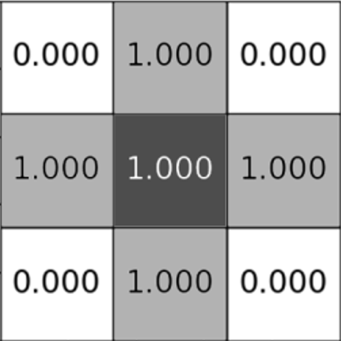

#  MatViz3D

Tool for microstructure modeling using cellular automata
___
[English Version](#english-version) | [Українська версія](#українська-версія)
___

## English Version

Welcome to the Material Structure Visualization Tool! This application allows you to explore and analyze microstructures of materials through computer-generated simulations and visualizations.

### Key Features

- Choose an algorithm for analyzing material microstructure. Available algorithms are:
  

  
1. Von Neumann Cellular Automaton

  *Origin*:\
  The Von Neumann Cellular Automaton, developed by John von Neumann, first appeared in the 1940s. Von Neumann introduced the concept of a self-replicating machine     composed of simple rules of interaction between individual elements (cells) in space. He used this concept to explore processes of self-reproduction and evolution.

  *Operation*:\
  In the Von Neumann cellular automaton, each cell (excluding boundary cells) has 6 neighbors since a cell is considered a neighbor only if it shares an edge with the grain (source cell). The future state of the cell depends on the state of the grain and its neighbors:

  y’[k][i][j] = f(y[k][i][j], y[k + 1][i][j], y[k][i + 1][j], y[k][i][j - 1], y[k][i][j + 1], y[k][i - 1][j], y[k - 1][i][j])

  *Example Fill*:\
  

  

  

  
2. Moore Cellular Automaton

  *Origin*:\
  The Moore Cellular Automaton was proposed and developed by American physicist Edward Fredkin Moore in 1962. This type of cellular automaton is one of the most common and researched in the field of complex system studies and artificial life.

  *Operation*:\
  In the Moore cellular automaton, each cell (excluding boundary cells) has 26 neighbors since a cell is a neighbor to the grain (source cell) if they share an edge or vertex. The future state of the cell depends on the state of the grain and its neighbors:

  y’[k][i][j] = f(y[k][i][j], 
  y[k + 1][i][j], 
  y[k + 1][i][j - 1],\
  y[k + 1][i][j + 1], 
  y[k + 1][i + 1][j], 
  y[k + 1][i + 1][j - 1],\ 
  y[k + 1][i + 1][j + 1],
  y[k + 1][i - 1][j],
  y[k + 1][i - 1][j - 1],\
  y[k + 1][i -1][j + 1], 
  y[k][i][j],
  y[k][i][j - 1], 
  y[k][i][j + 1], 
  y[k][i + 1][j],\
  y[k][i + 1][j - 1], 
  y[k][i + 1][j + 1], 
  y[k][i - 1][j],
  y[k][i - 1][j - 1],\ 
  y[k][i -1][j + 1], 
  y[k - 1][i][j], 
  y[k - 1][i][j - 1],
  y[k - 1][i][j + 1],\
  y[k - 1][i + 1][j], 
  y[k - 1][i + 1][j - 1], 
  y[k - 1][i + 1][j + 1],\ 
  y[k - 1][i - 1][j], 
  y[k - 1][i - 1][j - 1], 
  y[k - 1][i -1][j + 1])

  *Example Fill*:\
  

  

  

  
3. Probabilistic Circle Cellular Automaton

  *Origin*:\
  The Probabilistic Circle Cellular Automaton is a modification of the classical cellular automaton, introducing random or probabilistic elements. The concept of using probabilities in cellular automata has been explored for many years. An early work in this field is by John Hopfield and Nancy H. Himmel in 1986, where they proposed a probabilistic cellular automaton model for modeling neural networks.

  *Operation*:\
  The number of grain (source cell) neighbors and the principle of neighborhood are the same as in the Moore cellular automaton. However, the difference lies in assigning a probability to each neighbor indicating the likelihood of it being filled.

  *Example Fill*:\
  

  

  

  
4. Probabilistic Ellipse Cellular Automaton

  *Origin*:\
  The Probabilistic Ellipse Cellular Automaton is a modification of the "Probabilistic Circle," differing only in the probability of grain (source cell) neighbors     being filled.

  *Example Fill*:\
  

  

- Visualize microstructures in 3D format for detailed analysis.
- Zoom and rotate the material cube for closer inspection.
- Save images in various formats for documentation.
- View the histogram of generated grain volume distribution.
- Experience animations for microstructure generation.

### Installation

1. Clone the repository: `git clone https://github.com/MME-NTU-KhPI/MatViz3D.git`

### Usage

1. Launch the application.
2. Enter the size of the cube and the number of initial points.
3. Select an algorithm for analyzing material microstructure and press the START button.
4. Explore the 3D microstructure visualization.
5. Zoom and rotate for a detailed view.
6. Save images for documentation.

### Examples

#### Analyzing Material Structure Using Algorithms

  

    
  

  

    
  

  

    
  

  

    
  

### Authors

:small_blue_diamond: Oleksii Vodka ([a-vodka](https://github.com/a-vodka) )\
:small_blue_diamond: Valeriia Hritskova ([Val2004H](https://github.com/Val2004H)) \
:small_blue_diamond: Anastasiіa Korzh \
:small_blue_diamond: Nikita Mityasov ([Nekit2003](https://github.com/Nekit2003)) \
:small_blue_diamond: Oleh Semenenko ([HappyNext](https://github.com/HappyNext)) \
:small_blue_diamond: Kateryna Skrynnik \
:small_blue_diamond: Yuliia Chepela 

___

## Українська версія

Ласкаво просимо до Застосунку візуалізації структури матеріалів! Цей додаток дозволяє досліджувати та аналізувати мікроструктури матеріалів за допомогою комп'ютерних симуляцій та візуалізації.

### Основні можливості

- Вибір алгоритму для аналізу мікроструктури матеріалу. Доступні алгоритми:
  

  
1. Клітинний автомат фон Неймана

  *Виникнення*:\
  Клітинний автомат, розроблений Джоном фон Нейманом, уперше з'явився у 1940-х роках. Фон Нейман представив концепцію самовідтворювальної машини, що складалася з простих правил взаємодії між окремими елементами (клітинами) у просторі. Він використав цю концепцію для дослідження процесів самовідтворення та еволюції.\
  
  *Принцип роботи*:\
  У клітинному автоматі фон Неймана кожна клітина(якщо вона не являється крайовою) має 6 сусідів, оскільки сусідом вважається лише та клітина, яка має спільну сторону з зерном(вихідною клітиною). Від стану зерна та стану її сусідів залежить майбутній стан самої клітини:\
  y’[k][i][j] = f(y[k][i][j], y[k + 1][i][j], y[k][i + 1][j],\ y[k][i][j - 1], y[k][i][j + 1], y[k][i - 1][j], y[k - 1][i][j]) 
  
  *Приклад заповнення*:\
   
  

  

  
2. Клітинний автомат Мура

  *Виникнення*:\
  Клітинний автомат Мура був запропонований та розроблений американським фізиком Едвардом Фредкіном Муром у 1962 році. Цей тип клітинного автомата одна із найпоширеніших і досліджуваних у сфері дослідження складних систем і штучної життя.
  
  *Принцип роботи*:\
  У клітинному автоматі Мура кожна клітина(якщо вона не являється крайовою) має 26 сусідів, оскільки клітина являється сусідом зерна(вихідної клітини), якщо вона має з нею спільну сторону, або вершину. \
  Від стану зерна та стану її сусідів залежить майбутній стан самої клітини: \
  y’[k][i][j] = f(y[k][i][j], 
  y[k + 1][i][j], 
  y[k + 1][i][j - 1],\
  y[k + 1][i][j + 1], 
  y[k + 1][i + 1][j], 
  y[k + 1][i + 1][j - 1],\ 
  y[k + 1][i + 1][j + 1],
  y[k + 1][i - 1][j],
  y[k + 1][i - 1][j - 1],\
  y[k + 1][i -1][j + 1], 
  y[k][i][j],
  y[k][i][j - 1], 
  y[k][i][j + 1], 
  y[k][i + 1][j],\
  y[k][i + 1][j - 1], 
  y[k][i + 1][j + 1], 
  y[k][i - 1][j],
  y[k][i - 1][j - 1],\ 
  y[k][i -1][j + 1], 
  y[k - 1][i][j], 
  y[k - 1][i][j - 1],
  y[k - 1][i][j + 1],\
  y[k - 1][i + 1][j], 
  y[k - 1][i + 1][j - 1], 
  y[k - 1][i + 1][j + 1],\
  y[k - 1][i - 1][j], 
  y[k - 1][i - 1][j - 1], 
  y[k - 1][i -1][j + 1]) 
  
  *Приклад заповнення*:\
   
  

  

  
3. Клітинний автомат Імовірнісний круг

  *Виникнення*: \
  Імовірнісний круг (Probabilistic Cellular Automaton) є модифікацією класичного клітинного автомата, де введені випадкові або імовірнісні елементи. Концепція використання ймовірностей у клітинних автоматах досліджувалась протягом багатьох років. Одним із ранніх досліджень у цій галузі є робота Джона Хопфілда (John Hopfield) та Нансі Хеміль (Nancy H. Himmel) у 1986 році, де вони запропонували модель імовірнісного клітинного автомата для моделювання нейронних мереж.
  
  *Принцип роботи*: \
  Кількість сусідів зерна(вихідної клітини) та відповідно принцип сусідства такий же, як і у клітинному автоматі Мура. Але відмінність складається у тому, що у кожному сусіду надається вірогідність з якою він буде заповнений.
  
  *Приклад заповнення*:\
   
  

  

  
4. Клітинний автомат Імовірнісний еліпс

  *Виникнення*:\
  Імовірнісний еліпс є модифікацією “Імовірнісного круга”, відмінність якого від якого становить лише у вірогідності сусідів зерна(вихідної клітини)
  
  *Приклад заповнення*:\
   
  

- Візуалізація мікроструктур у форматі 3D для детального аналізу.
- Зум та обертання куба матеріалу для докладнішого огляду.
- Збереження зображень у різних форматах для документації.
- Перегляд гістограми розподілу об'єма згенерованих зерен.
- Анімація для генерації мікроструктури.

### Встановлення

1. Клонуйте репозиторій: `git clone https://github.com/MME-NTU-KhPI/MatViz3D.git`

### Використання

1. Запустіть додаток.
2. Введіть розмір куба, та кількість початкових точок
3. Виберіть алгоритм для аналізу мікроструктури матеріалу та натисни кнопку START.
4. Досліджуйте 3D візуалізацію мікроструктури.
5. Зум та обертайте для докладнішого огляду.
6. Збережіть зображення для документації.

### Приклади

#### Аналіз структури матеріалу з використанням різних алгоритмів

### Автори

:small_blue_diamond: Водка Олексій Олександрович ([a-vodka](https://github.com/a-vodka)) \
:small_blue_diamond: Гріцкова Валерія Іванівна ([Val2004H](https://github.com/Val2004H)) \
:small_blue_diamond: Корж Анастасія Сергіївна \
:small_blue_diamond: Мітясов Нікіта Олександрович ([Nekit2003](https://github.com/Nekit2003)) \
:small_blue_diamond: Семененко Олег Сергійович ([HappyNext](https://github.com/HappyNext)) \
:small_blue_diamond: Скринник Катерина Юріївна \
:small_blue_diamond: Чепела Юлія Володимирівна 
